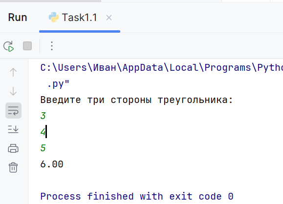
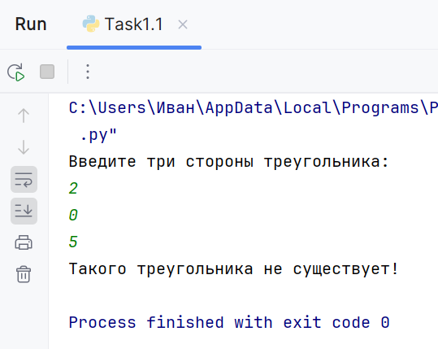
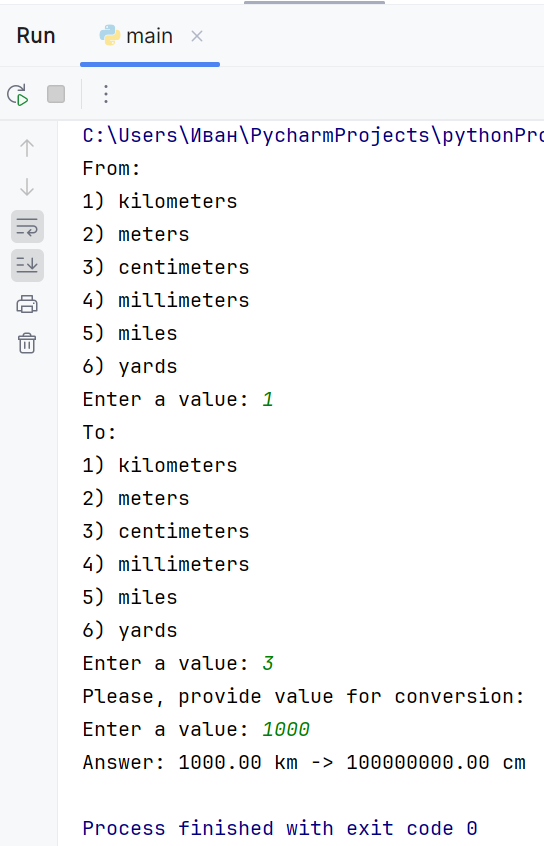
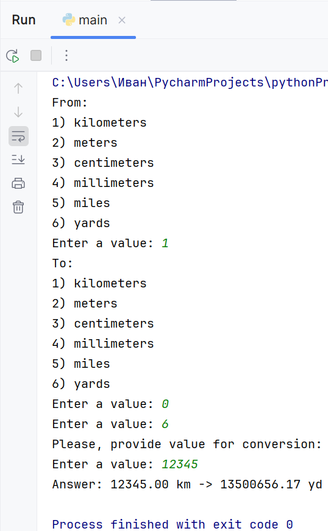
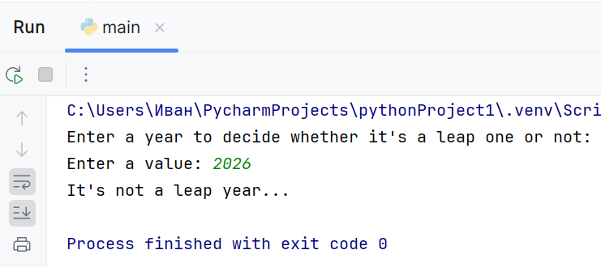
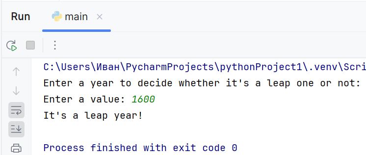

# Исполнитель
Бугаев Иван Владимирович, Фт-250007

# Лабораторная работа №2 - GitHub
Создать репозиторий и, включив в него три программы из лаб.работы №1, корректно описать README.md.
## Задание 1.1 - Калькулятор площади треугольника:
Калькулятор площади треугольника по трём его сторонам (по формуле Герона) с точностью до сотых
## Задание 1.2 - Конвертер расстояний:
Программа, переводит расстояние из одних единиц измерения в другие. Программа поддерживает следующие единицы: Километры (км), Метры (м), Сантиметры (см), Миллиметры (мм), Мили (mi), Ярды (yd).
## Задание 1.3 - Проверка високосного года:
Программа, которая определяет, является ли год високосным

# Среда разработки
Язык программирования: Python.
Среда разработки: Pycharm 2024.

# Инструкция по работе
## Задание 1.1:
По запросу программы необходимо ввести три числа, образующих стороны существующего треугольника.
## Задание 1.2
По запросу программы необходимо выбрать: изначальные единицы измерения, конечные единицы измерения, расстояние для перевода. Расстояние может быть отрицательным (иметь некую векторную направленность).
## Задание 1.3
По запросу программы необходимо ввести число: год для проверки на високосность.

# Результаты тестирования:
## Тесты задания 1:
Тест 1

Тест 2

## Тесты задания 2:
Тест 1

Тест 2

## Тесты задания 3:
Тест 1

Тест 2
